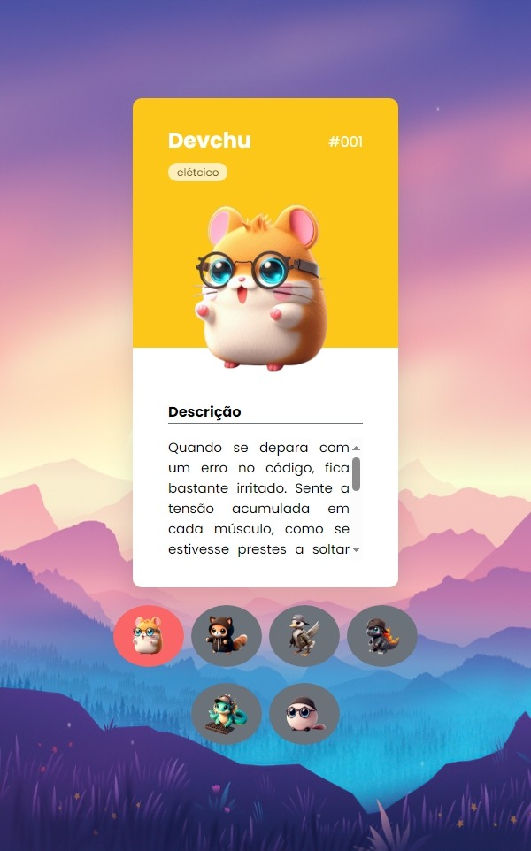
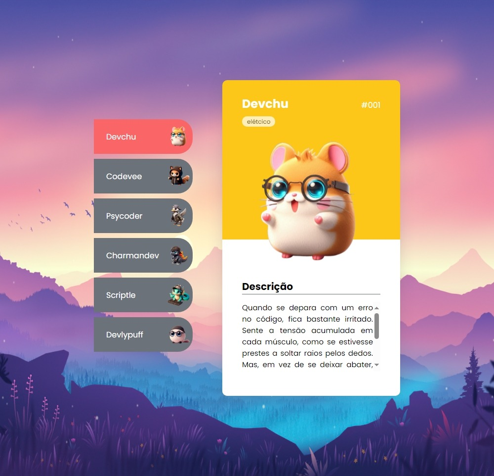

# Projeto Pokedevs

- Projeto criado na Semana do Zero ao Programador Contratado do mês de outubro de 2024 com os gêmeos do Dev em Dobro.

## ScreenShots

- Screnshots do site

    - versão mobile
    

    - versão desktop
    

## Tecnologias utilizadas

  

## Link

- Live Site: <a href="https://teoniuvilarinho.github.io/projeto-pokedevs" target="_blank">www.pokedevs.com</a>
